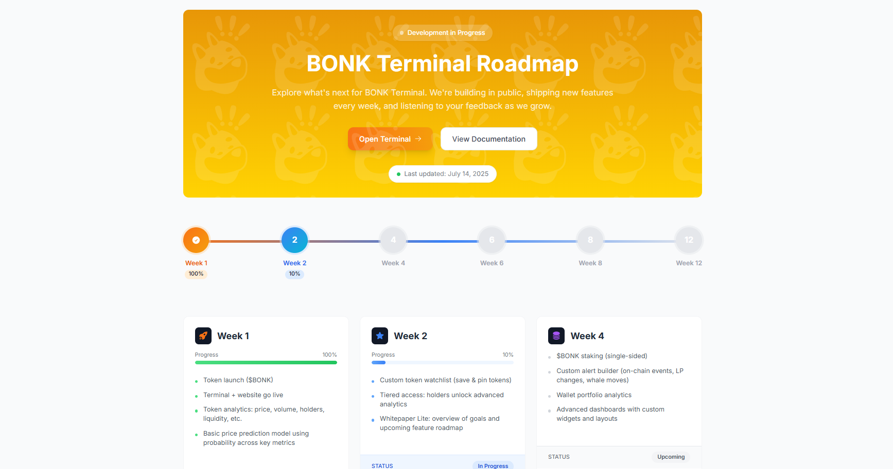

# BLYV Terminal

BLYV Terminal is a modern web application for exploring Solana tokens, viewing live trades, analyzing charts, and getting AI-powered price predictions. The platform provides a terminal-style interface for users to query Solana token information in real time, with live data from BLYV and Solana Tracker APIs. All backend logic is now handled within the frontend codebase for a simplified, single-app experience.

## Features

- **Terminal UI**: Search Solana tokens, view live trades, analyze charts, and get instant feedback in a terminal-inspired interface.
- **Live Data**: Fetches token info, price, market cap, 24h volume, and price change from Solana Tracker.
- **Candlestick Charts**: Visualizes token price history using interactive candlestick charts.
- **AI Summaries & Q&A**: Get concise, human-friendly token summaries and ask crypto-related questions, powered by OpenAI GPT-3.5.
- **Clipboard Support**: Easily copy token addresses and creator addresses.
- **Social Links**: Quick access to BLYV resources and social media.
- **Particles Background**: Enjoy a beautiful animated green particles background on the Roadmap page.
- **Modern Frontend & Backend**: Built with React, Tailwind CSS, and Vite. All backend logic (API calls, key management) is handled within the frontend app using environment variables and server-side code (via Vite's proxy and serverless functions if needed).

## Demo



## Getting Started

### Prerequisites
- Node.js (v16 or above)
- npm

### Clone the Repository
```sh
git clone https://github.com/pasindupiumal03/BLYV---vercel.git
cd BLYV---vercel/v1
```

### Environment Variables
Create a `.env` file in the `v1` directory. Use the provided `.env` as a template and **never commit your real API keys**.

#### Example `.env`
```
VITE_SOLANA_TRACKER_API_KEY=your-solana-tracker-api-key-here
VITE_SOLANA_TRACKER_API_URL=https://data.solanatracker.io
VITE_OPENAI_API_KEY=your-openai-api-key-here
```

> **Note:** Do NOT share your real API keys publicly or commit them to version control.

### Install Dependencies
Install all dependencies in the unified app:

```sh
npm install
```

### Running the App
Start the development server:
```sh
npm run dev
```

The app will be available at [http://localhost:5173](http://localhost:5173). All backend logic is handled internally.

## Project Structure
```
BLYV v1/
├── .env
├── index.html
├── package.json
├── postcss.config.js
├── public/
│   └── screenshot.png
├── src/
│   ├── App.jsx
│   ├── components/
│   │   ├── Terminal.jsx
│   │   ├── TokenDashBoard.jsx
│   │   ├── Roadmap.jsx
│   ├── index.css
│   ├── main.jsx
├── tailwind.config.js
├── vite.config.js
```

## Website Content

BLYV Terminal is your gateway to the Solana ecosystem. Search tokens, analyze live market data, and visualize price trends—all in a sleek, terminal-inspired UI. Enjoy AI-powered summaries and a beautiful animated particles background. Whether you're a trader, developer, or enthusiast, BLYV Terminal gives you the tools to explore and research Solana tokens with confidence.

- **Instant Token Lookup**: Enter a Solana token address to get live stats, price, and chart.
- **AI-Powered Summaries**: Get detailed, human-friendly token summaries and answers to crypto questions via OpenAI.
- **Secure**: Your API keys are handled via environment variables and server-side code (never commit real keys).
- **Open Source**: Contributions are welcome!

## Contributing
Pull requests are welcome! For major changes, please open an issue first to discuss what you would like to change.

## License
This project is licensed under the MIT License.

---

**BLYV Terminal** — Always DYOR (Do Your Own Research)!
